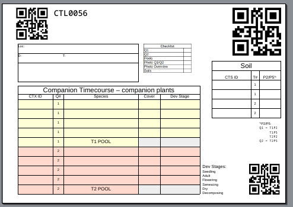

# Tools to generate "location sheets"

Sometimes you need a bit more than a simple text/qr code label. That's where this tool comes in. Create a temlate with e.g. Excel or Inkscape, then create an [svglue template](https://github.com/mbr/svglue/issues/9) in Inkscape.

To create a template, you need to have two or more items in the SVG file:

- A rectangle with the `template-id` attribute set to `id_image`, which will contain the QR image. You can add more than one by suffixing that with numbers, e.g. `id_image1`, `id_image2`, `...`.
- A text box (`tspan`) with `template-id` set to `id_text`, which will have the text of whatever the ID is. Again there can be many with `id_text1,2,3,...`.

There are a few templates from our research under `./templates`, which should be somewhat self-explanatory. If you have any questions, reach out (in github issues or via Email).

As an example, the below is an example of one sheet generated with the `templates/ctx_v2.svg` template.

In case the above link dies, this is how one adds the required attributes in inkscape.

> breifly, in inkscape:
> 
>  1) click the element you want to template
>
>  2) enter the XML editor (Edit -> XML Editor, or Ctrl+Shift+X for me)
>
>  3) add (with plus button) a row in the attribute table, whose Name (1st column) is template-id, and whose Value (2nd column) is your key text.
> 
> For text just make sure you do this on the tspan element not the text element that (for me) contains it, and which inkscape focuses when you click on the text in the document. I had to manually click the tspan element in the xml editor.
